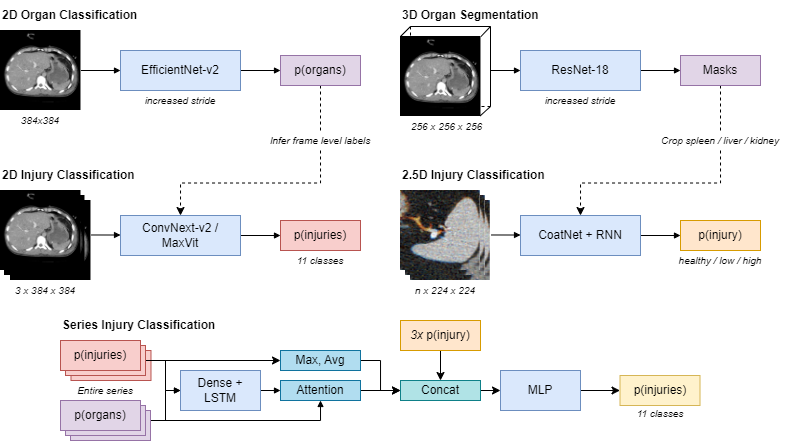

# 2nd Place Solution to the RSNA 2023 Abdominal Trauma Detection Competition

**Authors :** [Theo Viel](https://github.com/TheoViel)

## Introduction - Adapted from [Kaggle](https://www.kaggle.com/competitions/rsna-2023-abdominal-trauma-detection/discussion/447453)

This repository contains code to reproduce the 2nd place solution, achieving private LB 0.35.

Pipeline is below. It has two components: 
-	2D models + RNN, where the frame-level labels are inferred using organ visibility classification when needed. 
-	Crop models for kidney / liver / spleen. Results are fed to the RNN after pooling.



### 2D models 

The key to achieve good performance with 2D models is cleverly sampling frames to feed meaningful information and reduce label noise.
To do so, I use a simple but fast `efficientnetv2_rw_t` to infer which organs are present on every frame. During training, frames are sampled the following way:
- kidney / liver / spleen / negative bowel : Pick a random frame inside the organ.
- positive bowel / positive extravasation : Use the frame-level labels.
- Negative extravasation : Sample anywhere

This model extracts probabilities for every 1/2 frame in the stack, and a RNN is trained on top to aggregate results. 

**Details :**
- Heavy augmentations (HFlip, ShiftScaleRotate, Color augs, Blur augs, ElasticTransform) + cutmix (`p=0.5`)
- `maxvit_tiny_tf_512` was best. `convnextv2_tiny` and `maxvit_tiny_tf_384` were also great. 
- Ranger optimizer, `bs=32`, 40 epochs, `lr=4e-5`
- Only 3D info is the 3 adjacent frames used as channels.
- 11 classes : `[bowel/extravasation]_injury`(BCE optimized). And `[kidney/liver/spleen]_[healthy/low/high]`  optimized with the cross entropy.

### Crop models

Strategy is similar : key is to feed to the model crops where the information is located. In that case, I used a 3D `resnet18` to crop the organs, and feed the crop to a 2D CNN + RNN model. It improves performances on kidney, liver and spleen by a good margin. 

**Details :**
- Same augmentations with more cutmix (`p=1.`)
- Ranger optimizer, `bs=8`, 20 epochs, `lr=2e-5`
- Best model uses 11 frames sampled uniformly in the organ. I used different number of frames for ensembling.
- `coatnet_1_rw_224` + RNN was best. I used different heads (RNN + attention, transformers) and other models CoatNet variants for ensembling.
- 3 class cross-entropy loss.

### RNN model

It is trained separately. Its role is to aggregate information from previous model, and optimize the competition metric directly.

**Details :**
- Restrict stack size to 600 (for faster loading), use 1/2 frame (for faster 2D inference). Sequences are then resized to 200 for batching. 
- Heavily tweaked LSTM architecture :
  - 1x Dense + Bidi-LSTM for the 2D models probabilities. Input is the concatenation of the segmentation proba (`size=5`), the classification probas (`size=11 x n_models`), and the classification probas multiplied by the associated segmentation (`size=11 x n_models`)
  - Pool using probabilities predicted by the segmentation model to get organ-conditioned features.
  - Use the mean and max pooling of the `22 x n_models` 2D classification features
  - Independent per organ logits, which have access to the corresponding pooled features. For instance the kidney logits sees only the crop features for the kidney (`3x n_crop_models` fts) , the RNN features pooled using the kidney segmentation, and the `6 x n_models` pooled 2D features for the kidney class.
- AdamW optimizer, `bs=64`, 10 epochs, `lr=4e-5`


### Scores : 
- 2D Classification + RNN :
 - Using ConvNext-v2: **Public 0.41** - **Private 0.39**
- Add the crop model:
 - MaxVit (instead of ConvNext) +  CoatNet-RNN : **Public 0.37** - **Private 0.35** (best private)
- Ensemble:
 - 3x2D models, 8x 2.5D models : **Public 0.35** - **Private 0.35**


## How to use the repository

### Prerequisites

- Clone the repository

- Download the data in the `input` folder:
  - [Competition data](https://www.kaggle.com/competitions/google-research-identify-contrails-reduce-global-warming/data). You can skip the dicoms and use the preprocessed data.
  - [Preprocessed data](https://www.kaggle.com/competitions/rsna-2023-abdominal-trauma-detection/discussion/427427)


- Setup the environment :
  - `pip install -r requirements.txt`

- I also provide trained model weights :
  - [Link](https://www.kaggle.com/datasets/theoviel/rsna-abdomen-weights-1). Refer to cell 10 of [this notebook](https://www.kaggle.com/code/theoviel/rsna-abdominal-inf?scriptVersionId=146119491)


### Run The pipeline

#### Preparation

Preparation is done is the `notebooks/Preparation.ipynb` notebook. This will save the frame 4 in png using the false_color scheme in png for faster 2D training.

#### Training

- `bash train.sh` will train the 2D models. Downloading the external data is required.
- `bash train_end2end.sh` will train the 2D model and finetune it on 2.5D. 

#### Validation

Validation is done is the `notebooks/Validation.ipynb` notebook. Make sure to replace the `EXP_FOLDER` vairables with your models

#### Inference

Inference is done on Kaggle, notebook is [here](https://www.kaggle.com/code/theoviel/contrails-inference-comb).


### Code structure

If you wish to dive into the code, the repository naming should be straight-forward. Each function is documented.
The structure is the following :

```
src
├── data
│   ├── dataset.py              # Dataset class
│   ├── loader.py               # Dataloader
│   ├── preparation.py          # Data preparation
│   ├── shape_descript.py       # Shape descriptors aux target
│   └── transforms.py           # Augmentations
├── model_zoo 
│   ├── aspp.py                 # ASPP center block
│   ├── models.py               # Segmentation model wrapper
│   ├── transformer.py          # Transformer temporal mixer
│   └── unet.py                 # Customized U-Net
├── training                        
│   ├── losses.py               # Losses
│   ├── lovasz.py               # Lovasz loss
│   ├── main.py                 # k-fold and train function
│   ├── meter.py                # Segmentation meter
│   ├── mix.py                  # Cutmix and Mixup
│   ├── optim.py                # Optimizers
│   └── train.py                # Torch fit and eval functions
├── util
│   ├── logger.py               # Logging utils
│   ├── metrics.py              # Metrics for the competition
│   ├── plots.py                # Plotting utils
│   ├── rle.py                  # RLE encoding
│   └── torch.py                # Torch utils
├── inference_main.py           # Inference functions
├── main_end2end_convnext.py    # Pretrains and trains a convnext-nano 2.5D model
├── main_end2end_v2s.py         # Pretrains and trains a v2-s 2.5D model
├── main.py                     # Trains a v2-s 2D model on external data
└── params.py                   # Main parameters
``` 
